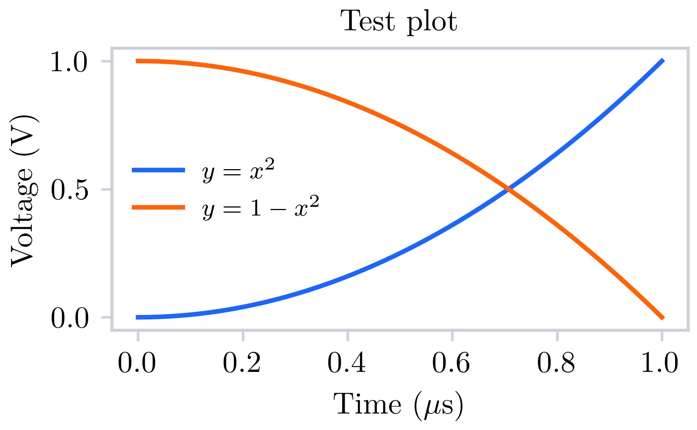
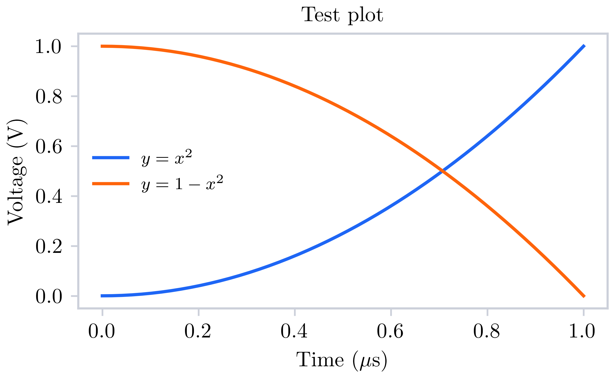

# Bramplot

Tired of fiddling with `matplotlib` and `pyplot` to get good looking figures for your publications/presentation?
Tired of writing boiler plate code to export your plots to different formats?
Did people complain *again* about axis labels that are hard to read?
No more!

`bramplot` extends `pyplot` with a few handy functions and sensible defaults to make sure your figures look good in academic publications and presentations.

**TODO: put a cool AND good looking example here**

## Basic principle

The main idea of this package is to make sure that your figures have the right *width/height* and *font size*.
The width should be exactly the linewidth wherever you place your figure, while the font size typically looks best when it is equal to the caption size.

## Contents

1. [Installation](#installation)
1. [TL;DR recipe](#recipe-tldr--i-dont-have-time)
1. [Optimal recipe](#recipe-optimally-sized-figures)
1. [Level 1: Replace pyplot import](#level-1-replace-pyplot-import)
1. [Level 2: Use optimal figure width and font size](#level-2-use-optimal-figure-width-and-font-size)
1. [Find figure width and font size in your document](#finding-out-figure-width-and-font-size)
1. [Batch export figure formats](#batch-export-figure-formats)
1. [Development](#development)
1. [Inspiration](#inspiration)

## Goals

- [ ] Introduce extra save format `.fig`
- [ ] Batch export formats

## Installation

```sh
pip install git+https://github.com/brambozz/bramplot
```

## Recipe: TL;DR / I don't have time

Replace

```py
import matplotlib.pyplot as plt
```

By

```py
import bramplot as plt
```

## Recipe: Optimally sized figures

1. Figure out optimal figure `width` (and optionally `height`) in inch and `font` size in pt. (see [here](#finding-out-figure-width-and-font-size))
2. Make your figure.

```py
import bramplot as plt

fig = plt.figure()
...
```

3. Set the sizes you found.

```py
plt.set_sizes(width=..., height=..., font=...)
```

4. Export to desired formats.

```py
fig.savefig(/path/to/image, formats=["png", "pdf", "svg"])
```

## Level 1: Replace pyplot import

If you just want a figure which looks decent out of the box, without worrying about sizes, simply replace your `import matplotlib.pyplot as plt` import with `import bramplot as plt`.
You can use all functions in `plt`, but the output has better defaults for colors and readability.

```py
import bramplot as plt
import numpy as np

def plot():
    x = np.linspace(0, 1, 50)
    y = x**2

    fig = plt.figure()
    plt.plot(x, y, label="$y=x^2$")
    plt.plot(x, 1-y, label="$y=1-x^2$")
    plt.xlabel(r"Time ($\mu$s)")
    plt.ylabel("Voltage (V)")
    plt.title("Test plot")
    plt.legend()

    return fig

fig = plot()
fig.savefig(filepath.format)
```

**bramplot**



**Standard matplotlib**


## Level 2: Use optimal figure width and font size

Ideally, the figures you export have exactly the width they will have in your document.
This way, they don't have to be resized and font sizes stay exactly how you set them in python.
Additionally, having titles and labels the same font size as the caption text looks best.
The default setting in `bramplot` is a width of 3.176 inches, which is the image width in a standard Latex double column article class document.
The height is according to the golden ratio.
If you know your desired figure width in inches and text size in pt, specify those with the function `set_size()`.
Here are some examples of usage of the `plt.set_size()` function:

**Specify only width for golden ratio**

```
fig = plot()
plt.set_size(width=4)
```



**Set aspect to square**

```
plt.set_size(aspect="square")
```


**Custom size and aspect ratio**

```
plt.set_size(width=3, height=1.5)
```


**Edit font size**

```
plt.set_size(width=3, height=1.5, font=8)
```


## Finding out figure width and font size

`bramplot` includes a script to determine the figure width and caption font size for a latex project.
Use it as follows:

1. Insert the default example image into your latex document, using *exactly* the following bit of latex:

```tex
\begin{figure}
    \includegraphics[width=\linewidth]{example-image-a.png}
    \caption{This text is to detect the caption.}
\end{figure}
```

2. Export the pdf.
3. Run the script:

```sh
python -m bramplot.find_sizes /path/to/file.pdf
```

The script will print the figure width and caption size, which you can then set with `plt.set_size()`.

If you don't use latex, you can still insert `example-image-a.png` in your document.
It is included in this repository in the `images` directory.
Insert with the same caption text as above: 'This text is to detect the caption.'.
Then export to pdf and run the script.

### Figure sizes for posters / presentations

In articles, you typically use some template with predefined widths and text sizes.
For presentation or posters, these might be different throughout your document.
You can usually find a good figure size by placing a dummy rectangle and resizing that to your desired size.
Then find the size of that rectangle in inches and set that with `plt.set_size()`.

## Batch export figure formats

`bramplot` extends the `savefig` function with the option to batch export formats.
It is often handy to have all your figures in `.png`, `.pdf` and `.svg`.
This becomes a one-liner:

```py
fig.savefig("/path/to/figure", format=["png", "pdf", "svg"])
```

## Development

For development I use a blank conda environment:

```sh
conda create -n bramplot python hatchling
```

And then install as an editable package:

```sh
conda activate bramplot
pip install --no-build-isolation -e .
```

## Inspiration

- [Jack Walton](https://jwalton.info/Embed-Publication-Matplotlib-Latex/)
- [SciencePlots](https://github.com/garrettj403/SciencePlots)
