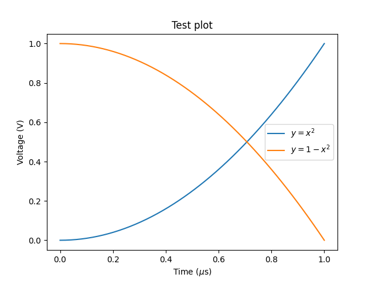

# Bramplot

## Goals

- [x] Just using `plt` as usual should give satisfying plots
- [x] Command line functionality which takes in `.tex` or `.pdf` and figures out appropriate sizes
- [x] Good default styles based on scienceplots and catppuccin
- [ ] Overwrite `plt` import and introduce extra save format `.fig`

## TL;DR

```
pip install bramplot
```

And replace

```py
import matplotlib.pyplot as plt
```

With

```py
import bramplot as plt
```

## Level 1: Replace pyplot import

If you just want a figure which looks decent out of the box, without worrying about sizes, simly replace your typical `import matplotlib.pyplot as plt` import with `import bramplot as plt`.
You can use all functions in `plt`, but the output has better defaults for colors and readability.

```py
import bramplot as plt
import numpy as np

def plot():
    x = np.linspace(0, 1, 50)
    y = x**2

    fig = plt.figure()
    plt.plot(x, y, label="$y=x^2$")
    plt.plot(x, 1-y, label="$y=1-x^2$")
    plt.plot(x, sinusoid, label=r"$y=\sin (2\pi x)$")
    plt.xlabel(r"Time ($\mu$s)")
    plt.ylabel("Voltage (V)")
    plt.title("Test plot")
    plt.legend()

    return fig

fig = plot()
fig.savefig(filepath.format)
```

**bramplot**


**Standard matplotlib**



## Level 2: Use optimal figure width and text size

Ideally, the figures you export have exactly the width they will have in your document.
This way, they don't have to be resized and font sizes stay exactly how you set them in python.
Additionally, having titles and labels the same font size as the caption text looks best.
The default setting in `bramplot` is a width of 3.176 inches, which is the image width in astandard Latex double column article class document.
The height is according to the golden ratio.
If you know your desired figure width in inches and text size in pt, specify those with the function `set_sizes()`.

**Specify only width for golden ratio**

```
fig = plot()
plt.set_size(width=4)
```


**Set aspect to square**

```
plt.set_size(aspect="square")
```


**Custom size and aspect ratio**

```
plt.set_size(width=3, height=1.5)
```


### Finding out figure width and font size

`bramplot` includes a script to determine the figure width and caption font size for a latex project.

1. Insert the default example image into your latex document, using *exactly* the following bit of latex:

```tex
\begin{figure}
    \includegraphics[width=\linewidth]{example-image-a.png}
    \caption{This text is to detect the caption.}
\end{figure}
```

2. Export the pdf.
3. Run the script:

```sh
python -m bramplot.find_sizes /path/to/file.pdf
```

If you don't use latex, you can still insert `example-image-a.png` in your document.
It is included in this repository in the `images` directory.
Insert with the same caption text as above: 'This text is to detect the caption.'.
Then export to pdf and run the script.

### Figure sizes for posters / presentations

In articles, you typically use some template with predefined widths and text sizes.
For presentation or posters, these might be different through your document.
You can usually find a good figure size by placing a dummy rectangle and resizing that to your desired size.
Then find the size of that rectangle in inches.

## Development

For development I use a blank conda environment:

```sh
conda create -n bramplot python hatchling
```

And then install as an editable package:

```sh
conda activate bramplot
pip install --no-build-isolation -e .
```

